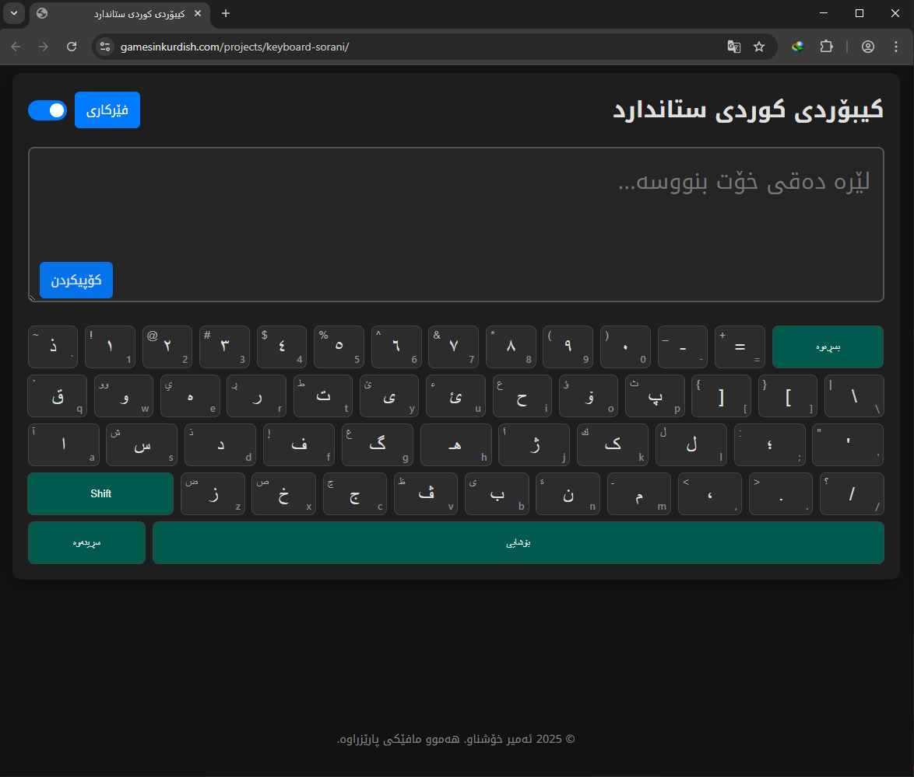

# Kurdish Keyboard HTML | کیبۆردی کوردی ستاندارد

https://gamesinkurdish.com/projects/keyboard-sorani/

> پرۆژەیەکی کیبۆردی کوردی (سۆرانی)ی ئۆنلاینە کە بە تەواوی ستانداردی ویندۆزی پەیڕەو کردووە. ئەم کیبۆردە بۆ چارەسەرکردنی پێویستیی نووسینێکی خێرا و ستاندارد لەسەر وێب دروستکراوە، بە دیزاینێکی سادە و کاراییەکی بەرز.

This is an open-source online Kurdish (Sorani) keyboard that strictly follows the official Windows layout. It was created to solve the need for a fast, standard, and accessible typing tool on the web, focusing on clean design and high performance.

---

### تایبەتمەندییە سەرەکییەکان

*   **دیزاینێکی مۆدێرن و ئارامبەخش:** بە دوو دۆخی ڕووناک و تاریکەوە، بۆ ئەوەی چاوەکانت ماندوو نەبن و بە ئاسوودەیی بنووسیت.
*   **ستانداردی فەرمی:** ١٠٠٪ هاوشێوەی کیبۆردی کوردیی سۆرانی لە سیستەمی ویندۆزدا. ئیتر پێویست ناکات فێری شێوازێکی نوێ بیت.
*   **هاوئاهەنگ لەگەڵ کیبۆردی فیزیکی:** وەک ئەوەی لە کۆمپیوتەرەکەی خۆتدا بینووسیت، کیبۆردی سەر شاشەکەش لەگەڵ داگرتنی دوگمەی `Shift` دەگۆڕێت.
*   **بۆ هەموو ئامێرێک:** جا لەسەر مۆبایل بیت یان کۆمپیوتەر، دیزاینەکە بە شێوەیەکی زیرەکانە خۆی دەگونجێنێت.
*   **کۆپیکردنی ئاسان:** بە یەک کرتە، هەموو نووسینەکەت کۆپی بکە و لە هەر شوێنێک دەتەوێت دایبنێ.
*   **فێرکاریی ڕوون:** ڕێنماییەکی سادە بۆ ئەو کەسانەی دەیانەوێت بزانن کام پیت لەسەر کام دوگمەیە.
*   **خێرا و بێ کێشە:** بەبێ هیچ پێداویستییەکی دەرەکی، تەنها یەک فایلە و خێرا کار دەکات.

---

### تەکنەلۆژیای بەکارهاتوو

*   HTML5
*   CSS3
*   JavaScript (Vanilla JS)

---

### دەستپێکردن

هیچ دامەزراندنێکی پێویست نییە. تەنها فایلی `source.html` دابگرە و لە وێبگەڕەکەتدا بیکەرەوە.

No installation is required. Simply download the `source.html` file and open it in your browser.

---

### مۆڵەت (License)

ئەم پڕۆژەیە لەژێر مۆڵەتی **MIT License** بڵاوکراوەتەوە.

This project is licensed under the **MIT License**.

---

### خاوەنی پڕۆژە

*   ئەمیر خۆشناو
